<!-- Improved compatibility of back to top link: See: https://github.com/othneildrew/Best-README-Template/pull/73 -->
<a name="readme-top"></a>
<!--
*** Thanks for checking out the Best-README-Template. If you have a suggestion
*** that would make this better, please fork the repo and create a pull request
*** or simply open an issue with the tag "enhancement".
*** Don't forget to give the project a star!
*** Thanks again! Now go create something AMAZING! :D
-->


<!-- PROJECT SHIELDS -->
<!--
*** I'm using markdown "reference style" links for readability.
*** Reference links are enclosed in brackets [ ] instead of parentheses ( ).
*** See the bottom of this document for the declaration of the reference variables
*** for contributors-url, forks-url, etc. This is an optional, concise syntax you may use.
*** https://www.markdownguide.org/basic-syntax/#reference-style-links
-->
[![Contributors][contributors-shield]][contributors-url]
[![Forks][forks-shield]][forks-url]
[![Stargazers][stars-shield]][stars-url]
[![Issues][issues-shield]][issues-url]
[![MIT License][license-shield]][license-url]
[![LinkedIn][linkedin-shield]][linkedin-url]


<!-- PROJECT LOGO -->
<br />
<div align="center">
  <a href="https://github.com/othneildrew/Best-README-Template">
    
  </a>

  <h3 align="center">Best-README-Template</h3>

  <p align="center">
    An awesome README template to jumpstart your projects!
    <br />
    <a href="https://github.com/othneildrew/Best-README-Template"><strong>Explore the docs »</strong></a>
    <br />
    <br />
    <a href="https://github.com/othneildrew/Best-README-Template">View Demo</a>
    ·
    <a href="https://github.com/othneildrew/Best-README-Template/issues">Report Bug</a>
    ·
    <a href="https://github.com/othneildrew/Best-README-Template/issues">Request Feature</a>
  </p>
</div>


<!-- TABLE OF CONTENTS -->
<details>
  <summary>Table of Contents</summary>
  <ol>
    <li>
      <a href="#about-the-project">About The Project</a>
      <ul>
        <li><a href="#built-with">Built With</a></li>
      </ul>
    </li>
    <li>
      <a href="#getting-started">Getting Started</a>
      <ul>
        <li><a href="#prerequisites">Prerequisites</a></li>
        <li><a href="#installation">Installation</a></li>
      </ul>
    </li>
    <li><a href="#usage">Usage</a></li>
    <li><a href="#roadmap">Roadmap</a></li>
    <li><a href="#contributing">Contributing</a></li>
    <li><a href="#license">License</a></li>
    <li><a href="#contact">Contact</a></li>
    <li><a href="#acknowledgments">Acknowledgments</a></li>
  </ol>
</details>


<!-- ABOUT THE PROJECT -->
## About The Project

[![Product Name Screen Shot][product-screenshot]](https://example.com)

There are many great README templates available on GitHub; however, I didn't find one that really suited my needs so I created this enhanced one. I want to create a README template so amazing that it'll be the last one you ever need -- I think this is it.

Here's why:
* Your time should be focused on creating something amazing. A project that solves a problem and helps others
* You shouldn't be doing the same tasks over and over like creating a README from scratch
* You should implement DRY principles to the rest of your life :smile:

Of course, no one template will serve all projects since your needs may be different. So I'll be adding more in the near future. You may also suggest changes by forking this repo and creating a pull request or opening an issue. Thanks to all the people have contributed to expanding this template!

Use the `BLANK_README.md` to get started.

<p align="right">(<a href="#readme-top">back to top</a>)</p>


### Built With

This section should list any major frameworks/libraries used to bootstrap your project. Leave any add-ons/plugins for the acknowledgements section. Here are a few examples.

* [![Next][Next.js]][Next-url]
* [![React][React.js]][React-url]
* [![Vue][Vue.js]][Vue-url]
* [![Angular][Angular.io]][Angular-url]
* [![Svelte][Svelte.dev]][Svelte-url]
* [![Laravel][Laravel.com]][Laravel-url]
* [![Bootstrap][Bootstrap.com]][Bootstrap-url]
* [![JQuery][JQuery.com]][JQuery-url]

<p align="right">(<a href="#readme-top">back to top</a>)</p>


<!-- GETTING STARTED -->
## Getting Started

This is an example of how you may give instructions on setting up your project locally.
To get a local copy up and running follow these simple example steps.

### Prerequisites

This is an example of how to list things you need to use the software and how to install them.
* npm
  ```sh
  npm install npm@latest -g
  ```

### Installation

_Below is an example of how you can instruct your audience on installing and setting up your app. This template doesn't rely on any external dependencies or services._

1. Get a free API Key at [https://example.com](https://example.com)
2. Clone the repo
   ```sh
   git clone https://github.com/your_username_/Project-Name.git
   ```
3. Install NPM packages
   ```sh
   npm install
   ```
4. Enter your API in `config.js`
   ```js
   const API_KEY = 'ENTER YOUR API';
   ```

<p align="right">(<a href="#readme-top">back to top</a>)</p>


<!-- USAGE EXAMPLES -->
## Usage

Use this space to show useful examples of how a project can be used. Additional screenshots, code examples and demos work well in this space. You may also link to more resources.

_For more examples, please refer to the [Documentation](https://example.com)_

<p align="right">(<a href="#readme-top">back to top</a>)</p>


<!-- ROADMAP -->
## Roadmap

- [x] Add Changelog
- [x] Add back to top links
- [ ] Add Additional Templates w/ Examples
- [ ] Add "components" document to easily copy & paste sections of the readme
- [ ] Multi-language Support
    - [ ] Chinese
    - [ ] Spanish

See the [open issues](https://github.com/othneildrew/Best-README-Template/issues) for a full list of proposed features (and known issues).

<p align="right">(<a href="#readme-top">back to top</a>)</p>


<!-- CONTRIBUTING -->
## Contributing

Contributions are what make the open source community such an amazing place to learn, inspire, and create. Any contributions you make are **greatly appreciated**.

If you have a suggestion that would make this better, please fork the repo and create a pull request. You can also simply open an issue with the tag "enhancement".
Don't forget to give the project a star! Thanks again!

1. Fork the Project
2. Create your Feature Branch (`git checkout -b feature/AmazingFeature`)
3. Commit your Changes (`git commit -m 'Add some AmazingFeature'`)
4. Push to the Branch (`git push origin feature/AmazingFeature`)
5. Open a Pull Request

<p align="right">(<a href="#readme-top">back to top</a>)</p>


<!-- LICENSE -->
## License

Distributed under the MIT License. See `LICENSE.txt` for more information.

<p align="right">(<a href="#readme-top">back to top</a>)</p>


<!-- CONTACT -->
## Contact

Your Name - [@your_twitter](https://twitter.com/your_username) - email@example.com

Project Link: [https://github.com/your_username/repo_name](https://github.com/your_username/repo_name)

<p align="right">(<a href="#readme-top">back to top</a>)</p>


<!-- ACKNOWLEDGMENTS -->
## Acknowledgments

Use this space to list resources you find helpful and would like to give credit to. I've included a few of my favorites to kick things off!

* [Choose an Open Source License](https://choosealicense.com)
* [GitHub Emoji Cheat Sheet](https://www.webpagefx.com/tools/emoji-cheat-sheet)
* [Malven's Flexbox Cheatsheet](https://flexbox.malven.co/)
* [Malven's Grid Cheatsheet](https://grid.malven.co/)
* [Img Shields](https://shields.io)
* [GitHub Pages](https://pages.github.com)
* [Font Awesome](https://fontawesome.com)
* [React Icons](https://react-icons.github.io/react-icons/search)

<p align="right">(<a href="#readme-top">back to top</a>)</p>


<!-- MARKDOWN LINKS & IMAGES -->
<!-- https://www.markdownguide.org/basic-syntax/#reference-style-links -->
[contributors-shield]: https://img.shields.io/github/contributors/othneildrew/Best-README-Template.svg?style=for-the-badge
[contributors-url]: https://github.com/othneildrew/Best-README-Template/graphs/contributors
[forks-shield]: https://img.shields.io/github/forks/othneildrew/Best-README-Template.svg?style=for-the-badge
[forks-url]: https://github.com/othneildrew/Best-README-Template/network/members
[stars-shield]: https://img.shields.io/github/stars/othneildrew/Best-README-Template.svg?style=for-the-badge
[stars-url]: https://github.com/othneildrew/Best-README-Template/stargazers
[issues-shield]: https://img.shields.io/github/issues/othneildrew/Best-README-Template.svg?style=for-the-badge
[issues-url]: https://github.com/othneildrew/Best-README-Template/issues
[license-shield]: https://img.shields.io/github/license/othneildrew/Best-README-Template.svg?style=for-the-badge
[license-url]: https://github.com/othneildrew/Best-README-Template/blob/master/LICENSE.txt
[linkedin-shield]: https://img.shields.io/badge/-LinkedIn-black.svg?style=for-the-badge&logo=linkedin&colorB=555
[linkedin-url]: https://linkedin.com/in/othneildrew
[product-screenshot]: images/screenshot.png
[Next.js]: https://img.shields.io/badge/next.js-000000?style=for-the-badge&logo=nextdotjs&logoColor=white
[Next-url]: https://nextjs.org/
[React.js]: https://img.shields.io/badge/React-20232A?style=for-the-badge&logo=react&logoColor=61DAFB
[React-url]: https://reactjs.org/
[Vue.js]: https://img.shields.io/badge/Vue.js-35495E?style=for-the-badge&logo=vuedotjs&logoColor=4FC08D
[Vue-url]: https://vuejs.org/
[Angular.io]: https://img.shields.io/badge/Angular-DD0031?style=for-the-badge&logo=angular&logoColor=white
[Angular-url]: https://angular.io/
[Svelte.dev]: https://img.shields.io/badge/Svelte-4A4A55?style=for-the-badge&logo=svelte&logoColor=FF3E00
[Svelte-url]: https://svelte.dev/
[Laravel.com]: https://img.shields.io/badge/Laravel-FF2D20?style=for-the-badge&logo=laravel&logoColor=white
[Laravel-url]: https://laravel.com
[Bootstrap.com]: https://img.shields.io/badge/Bootstrap-563D7C?style=for-the-badge&logo=bootstrap&logoColor=white
[Bootstrap-url]: https://getbootstrap.com
[JQuery.com]: https://img.shields.io/badge/jQuery-0769AD?style=for-the-badge&logo=jquery&logoColor=white
[JQuery-url]: https://jquery.com 


## Setup Guide to create docker network heavy-rental-network
1. The projects uses docker network heavy-rental-network to connect different docker containers used in this project.
2. You need to manually create the docker network to allow different container to have visiblity on each other.

   <video controls src="https://github.com/user-attachments/assets/52fe77ba-2066-4ca5-b45c-beeb0814fcaf" title="Creating new docker network heavy-rental-network"></video>


## Setup Guide for Visual Studio Code

1. Pull this repository to your desktop

   <video controls src="https://github.com/user-attachments/assets/f21daa30-dcb9-44b8-a93a-966e5689aeb6" title="Pulling Heavy Rental DevContainer Configuration Git Repository"></video>


2. Setup Visual Studio Code by installing these extension:
   * Remote Development (Extension ID: ms-vscode-remote.vscode-remote-extensionpack)
      
      Purpose: This extension allows you to develop your project in a docker container.
    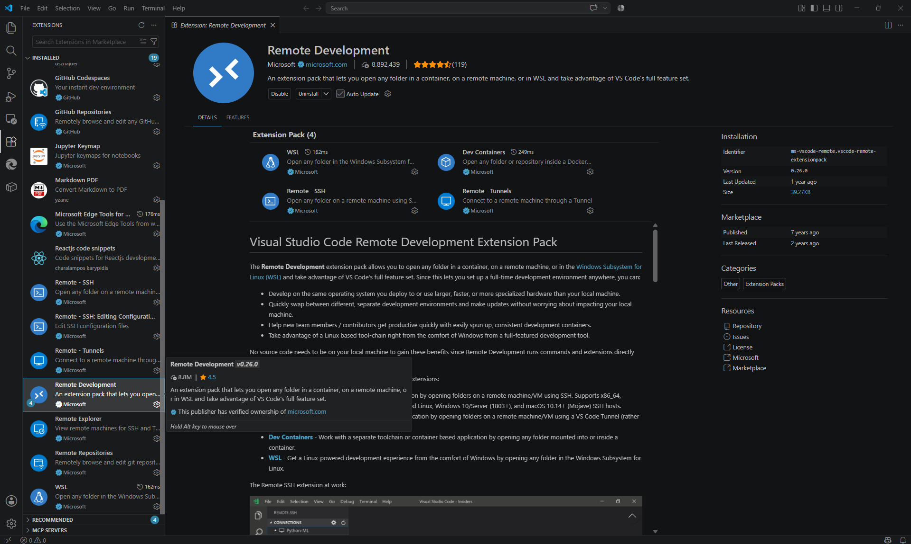

      <video controls src="https://github.com/user-attachments/assets/3ae3aef7-5672-4aa5-9230-68429f928d4c" title="Remote Development Extension Installation"></video>


   * Container Tools (Extension ID: ms-azuretools.vscode-containers) 

      Purpose: This extension helps you access the container directly to perform debugging 
    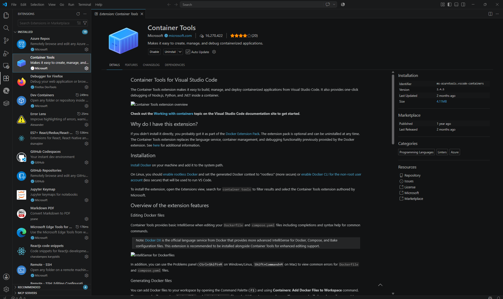
    
    <video controls src="https://github.com/user-attachments/assets/3843a0c8-4404-4894-ac56-8601a1196502" title="Container Tool Extension Installation"></video>


## Setup Guide for the Java Spring Boot REST API Project

Precondition
1. Visual Studio Code IDE is installed
2. Remote Development Extension is installed into Visual Studio Code IDE
3. Container Tools Extension is installed into Visual Studio Code IDE
4. You have created docker network heavy-rental-network


### Spring Boot REST API Project Setup Steps

Objective: To create DevContainer for Spring Boot REST API project

1. Go to Visual Studio Code IDE
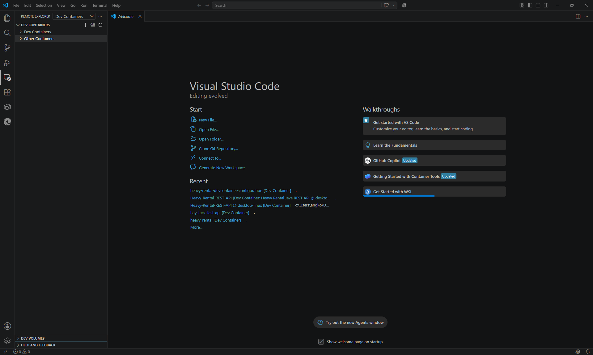

2. Click on the 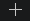 button to expand the Visual Studio Code Menu
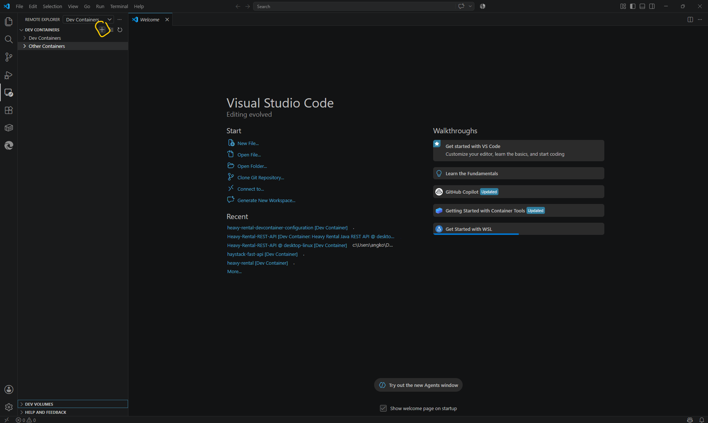

3. The menu will appear from the top window of the Visual Studio Code IDE
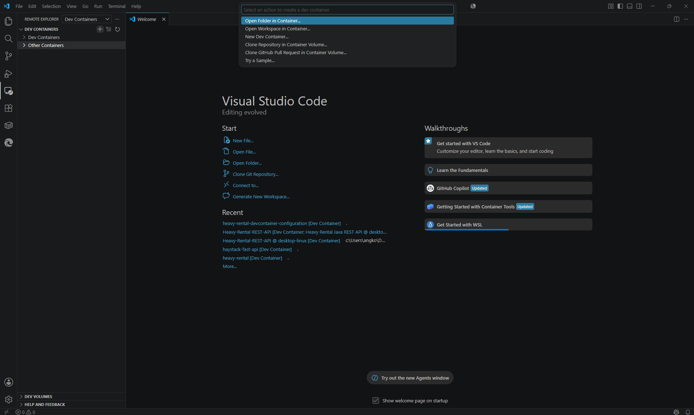

4. Select 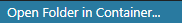 to trigger the open window to find the project folder `.devcontainer`
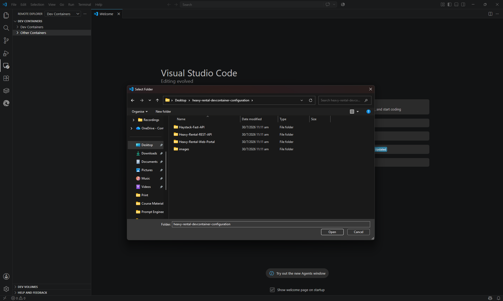


5. While the `Select Folder` window is still open from previous step 4, double click on the `Heavy-Rental-REST-API` to navigate into the `Heavy-Rental-REST-API` folder and Click 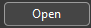 button
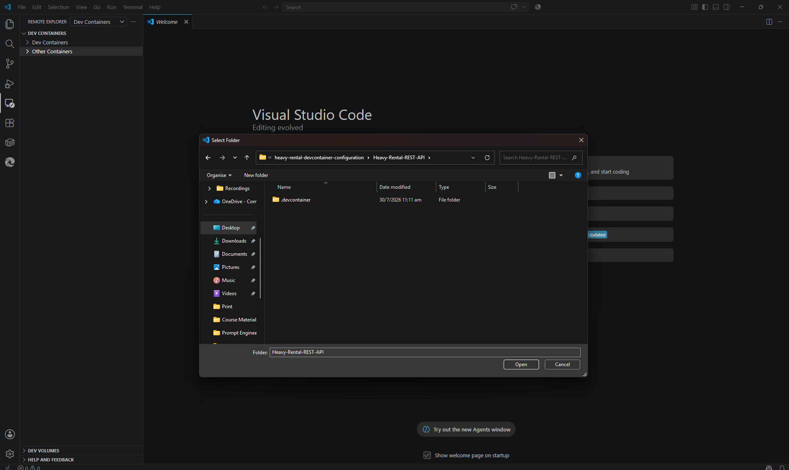


6. The pop up window shows the question asking if you trust the folder and its content. Click on 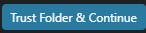 button to complete the process of creating Java Spring Boot DevContainer 
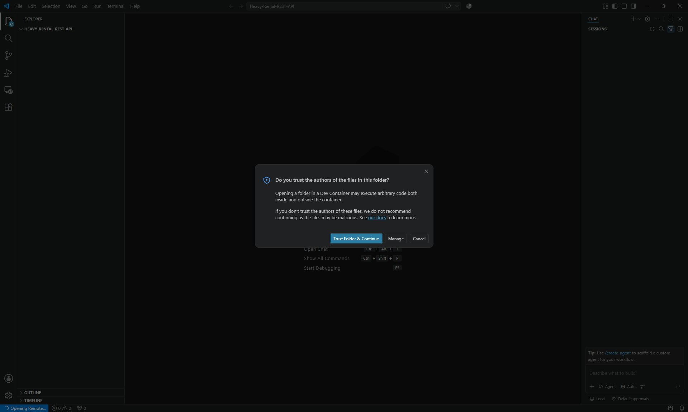

7. You should expect to see this window and you should see the mini window at the right bottom showing the text `Connecting to Dev Container (show log)`
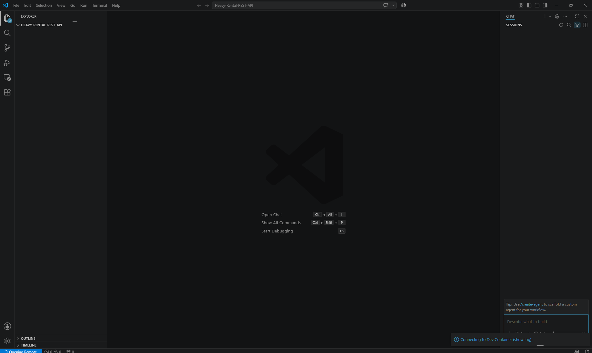


8. Click on the text `Connecting to Dev Container (show log)` to view the logs during the process of creating devcontainer
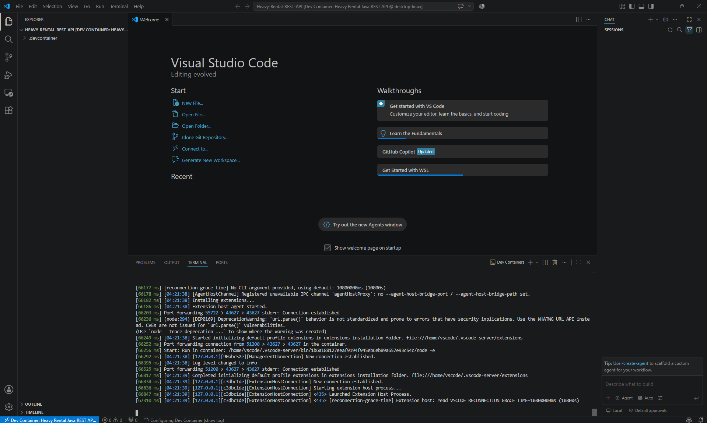

9. At the end of the process of creating devcontainer for Java Spring Boot REST API, you should be able to view the following extensions installed in your Dev Container within Visual Studio Code IDE.
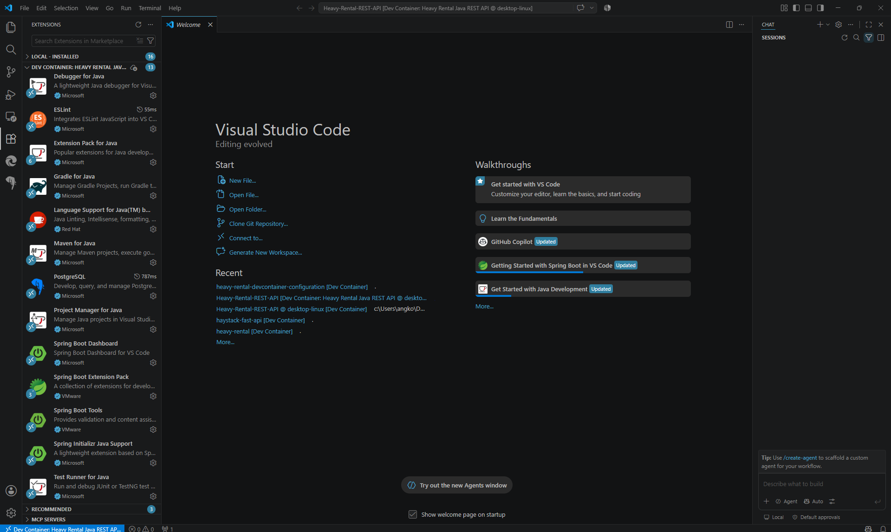


    The following visual studio code extension should be installed in the IDE:
    * Spring Boot Extension Pack (Extension ID: vmware.vscode-boot-dev-pack)
      * Spring Intializr Java Support (Extension ID: vscjava.vscode-spring-initializr)
      * Spring Boot Tools (Extension ID: vmware.vscode-spring-boot)
      * Spring Boot Dashboard (Extension ID: vscjava.vscode-spring-boot-dashboard)
    * Extension Pack for Java (Extension ID: vscjava.vscode-java-pack)
      * Language Support for Java(TM) by Red Hat (Extension ID: redhat.java)
      * Test Runner for Java (Extension ID: vscjava.vscode-java-test)
      * Gradle for Java (Extension ID: vscjava.vscode-gradle)
      * Project Manager for Java (Extension ID: vscjava.vscode-java-dependency)
      * Maven for Java (Extension ID: vscjava.vscode-maven )
      * Debugger for Java (vscjava.vscode-java-debug)
    * PostgreSQL (Extension ID: ms-ossdata.vscode-pgsql)


#### End to End Project Setup Video for Java Spring Boot REST API Project

 <video controls src="https://github.com/user-attachments/assets/538b6cdd-4554-4dd9-a040-c9f9214a7f26" title="End to End Project Setup Video for Java Spring Boot REST API Project"></video>


## Setup Guide for the Haystack + FastAPI Project

Precondition
1. Visual Studio Code IDE is installed
2. Remote Development Extension is installed into Visual Studio Code IDE
3. Container Tools Extension is installed into Visual Studio Code IDE
4. You have created docker network heavy-rental-network


### Haystack + Fast API Project (Haystack-Fast-API) Project Setup Steps

Objective: To create DevContainer for Haystack + Fast API project


1. Go to Visual Studio Code IDE


2. Click on the  button to expand the Visual Studio Code Menu


3. The menu will appear from the top window of the Visual Studio Code IDE


4. Select  to trigger the open window to find the project folder `.devcontainer`


5. While the `Select Folder` window is still open from previous step 4, double click on the `Haystack-Fast-API` to navigate into the `Haystack-Fast-API` folder 
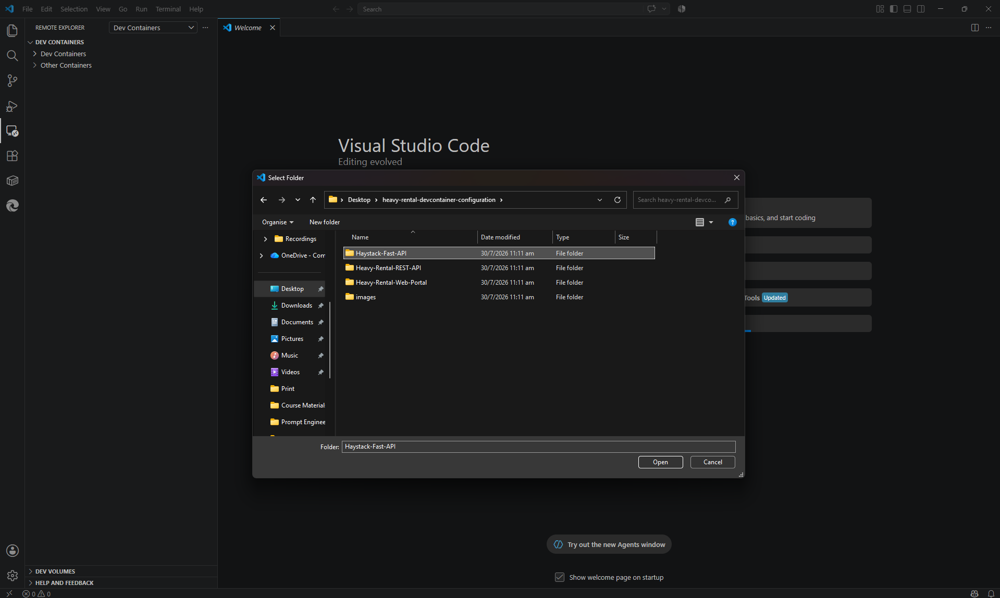


6. Click  button to start the process of creating `Haystack-Fast-API` devcontainer
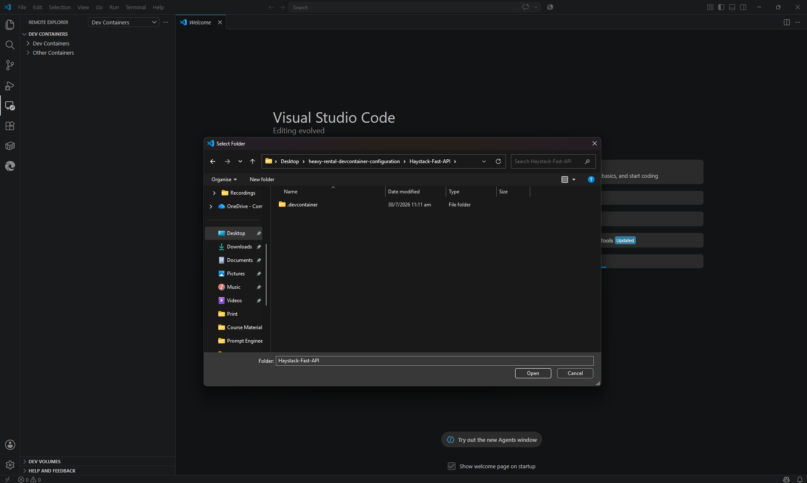


7. You should expect to see this window and you should see the mini window at the right bottom showing the text `Connecting to Dev Container (show log)`
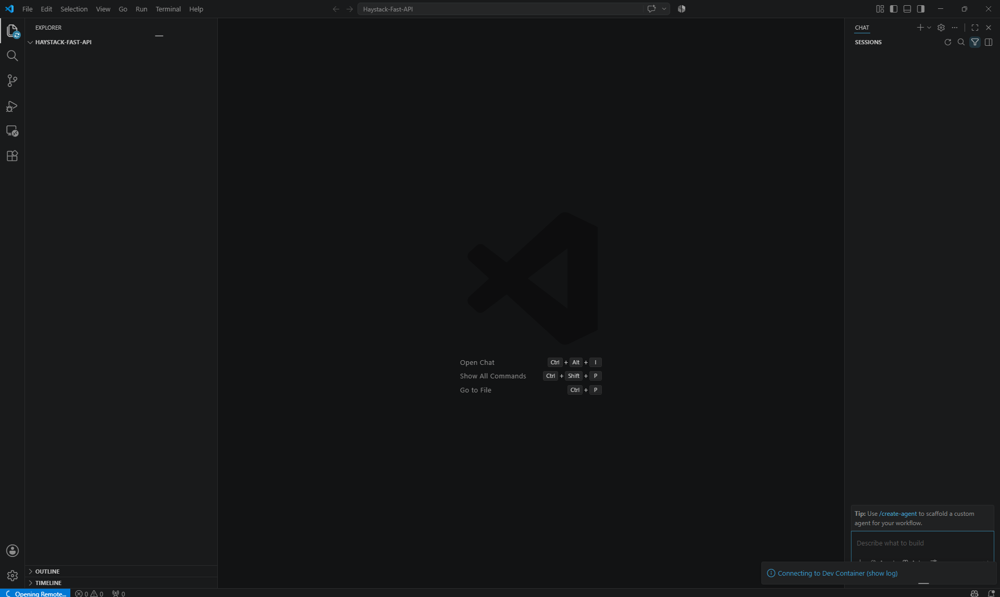


8. Click on the text `Connecting to Dev Container (show log)` to view the logs during the process of creating devcontainer
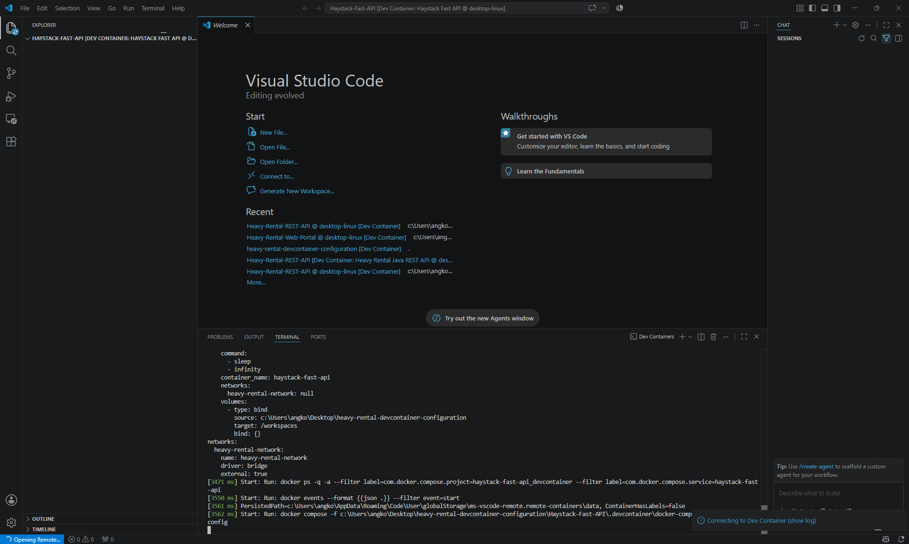

9. At the end of the process of creating devcontainer for `Haystack + Fast API`, you should be able to view the following extensions installed in your Dev Container within Visual Studio Code IDE.
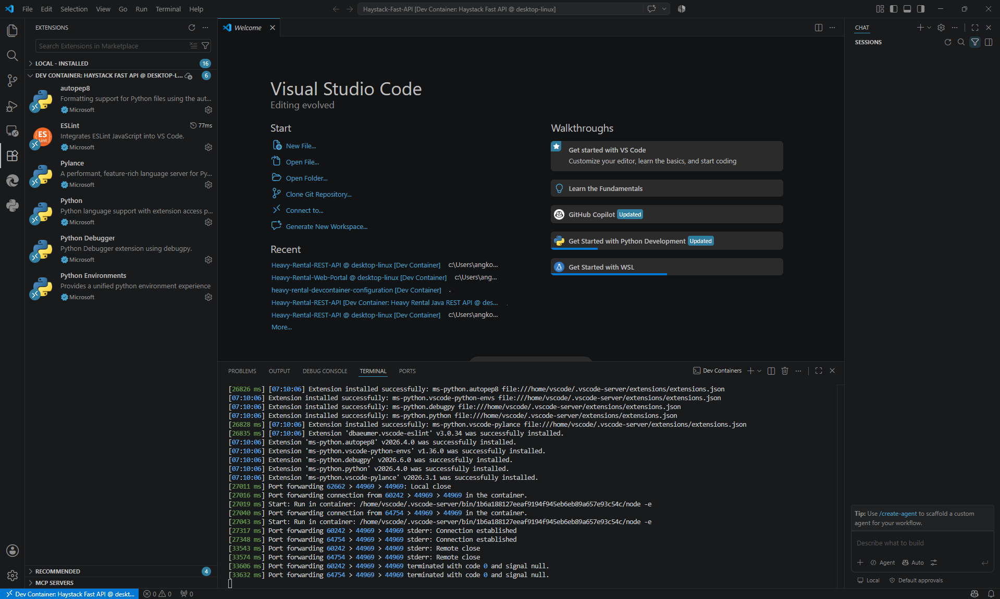


    The following visual studio code extension should be installed in the IDE:
    * autopep8 (Extension ID: ms-python.autopep8)
    * ESLint (Extension ID: dbaeumer.vscode-eslint)
    * Pylance (Extension ID: ms-python.vscode-pylance)
    * Python (Extension ID: ms-python.python)
    * Python Debugger (Extension ID: ms-python.debugpy)
    * Python Environments (Extension ID: ms-python.vscode-python-envs)


#### End to End Project Setup Video for Haystack + Fast API Project

 <video controls src="https://github.com/user-attachments/assets/c6f8e078-4f3f-4f31-badc-84a90633823d" title="End to End Project Setup Video for Haystack + Fast API Project"></video>


## Setup Guide for the React (Heavy Rental Web Portal) Project

Precondition
1. Visual Studio Code IDE is installed
2. Remote Development Extension is installed into Visual Studio Code IDE
3. Container Tools Extension is installed into Visual Studio Code IDE
4. You have created docker network heavy-rental-network

### React (Heavy Rental Web Portal) Project Setup Steps


1. Go to Visual Studio Code IDE


2. Click on the  button to expand the Visual Studio Code Menu


3. The menu will appear from the top window of the Visual Studio Code IDE


4. Select  to trigger the open window to find the project folder `.devcontainer`


5. While the `Select Folder` window is still open from previous step 4, double click on the `Heavy-Rental-Web-Portal` to navigate into the `Heavy-Rental-Web-Portal` folder
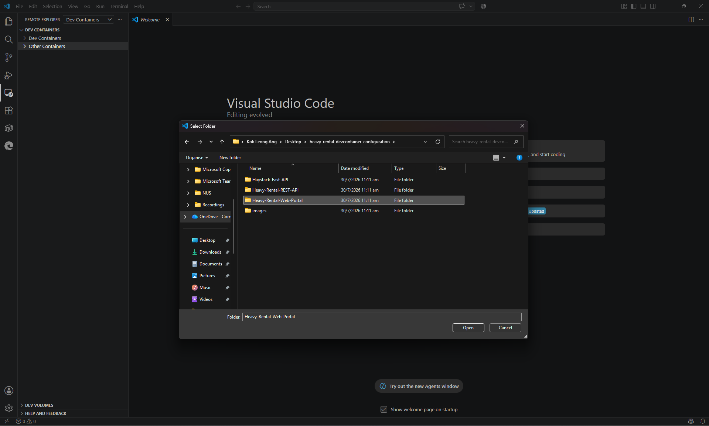

6. Click  button to start the process of creating `Heavy-Rental-Web-Portal` devcontainer
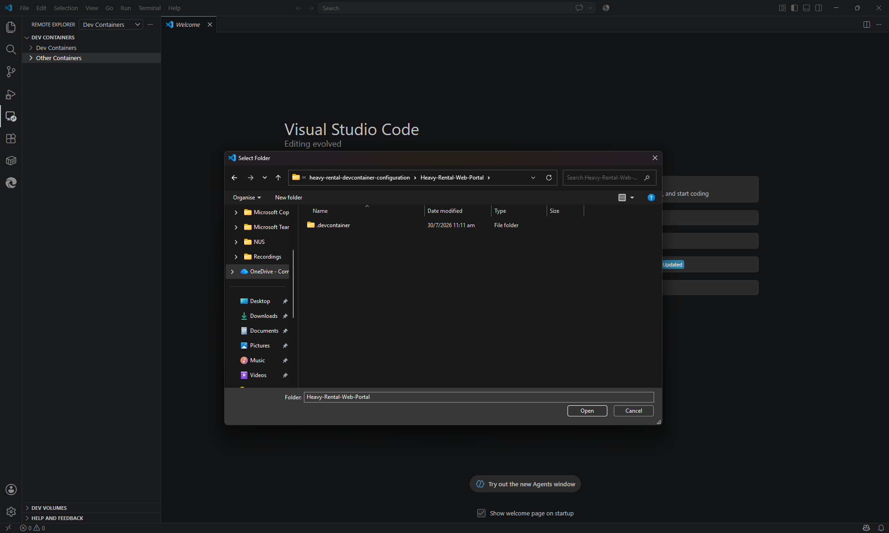


#### End to End Project Setup Video for Heavy Rental Web Portal Project

 <video controls src="https://github.com/user-attachments/assets/b607ccf1-e998-44d0-9700-6adc06315a21" title="End to End Project Setup Video for Heavy Rental Web Portal Project"></video>


