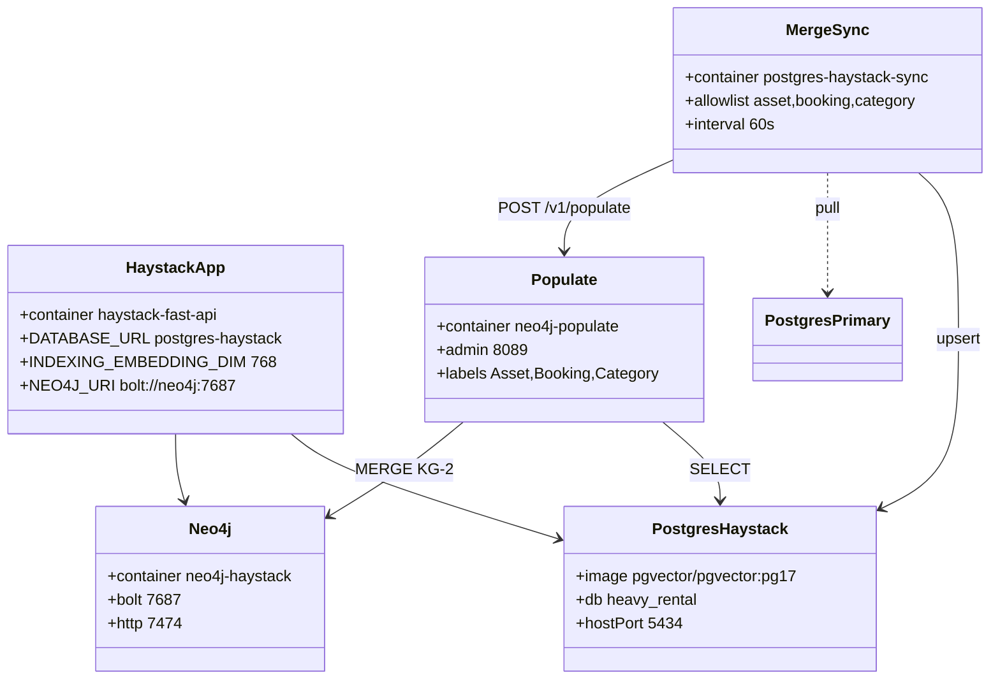

# Haystack Fast API devcontainer (as-built)

## Requirements

- Give Haystack developers a writable local Postgres sandbox plus near-real-time fleet awareness from REST primary without making Haystack the OLTP SoT.
- Provide Neo4j for DocumentStore (KG-1) and a fleet graph (KG-2) projected from the local SQL mirror.
- Keep the local DB vector-platform-ready (pgvector, dim 768) without implementing DocumentStore I0/I1 in this pack.

## Entities

`PostgresPrimary` is owned by the REST pack (not this canvas’s write target).

## Approach

1. **Local writable primary** for the app, not a streaming replica of REST (ADR-0003).
2. **FDW staging + PK/unique upsert**; additive schema evolution; retain local-only rows (default `SYNC_MODE=merge`).
3. **Poll 60s**, skip when primary down (ADR-0004).
4. **pgvector on this instance only** (ADR-0007). FAISS is historical (`specs/003`).
5. **Populate from local SQL** with MERGE-by-id; post-sync trigger is best-effort (ADR-0008).

## Structure

### Compose services

`haystack-fast-api`, `postgres-haystack`, `postgres-haystack-sync`, `neo4j`, `neo4j-populate` — all on `heavy-rental-network`.

### Layered architecture

1. App workspace / env
2. Local SQL (fleet mirror + vector extension)
3. Sync job (read primary, write local)
4. Populate job (read local, write KG-2)
5. Neo4j (KG-1 app-owned, KG-2 job-owned)

### Dependencies

1. Sync `depends_on` local Postgres healthy; primary is optional at start
2. Populate `depends_on` local Postgres + Neo4j health; missing tables skip
3. App `DATABASE_URL` MUST target `postgres-haystack`, never `postgres-primary`

## Operations

### Merge-sync cycle (`sync-from-primary.sh`)

1. `pg_isready` target
2. `pg_isready` source with retries
3. If source down: skip (default) or halt if `HALT_ON_PRIMARY_UNAVAILABLE=true`
4. FDW import (`LIMIT TO` allowlist when finite)
5. Additive CREATE TABLE / ADD COLUMN
6. Upsert by PK or unique key
7. Log METRICS; best-effort POST `NEO4J_POPULATE_TRIGGER_URL`
8. Sleep `SYNC_INTERVAL_SECONDS`

### Populate cycle (`populate_neo4j.py`)

1. For each allowlisted table with `id`: `MERGE (n:Label {id}) SET n += props`
2. Optional `IN_CATEGORY` / `FOR_ASSET` when FK-like fields exist
3. Rebuild / orphan prune: fleet labels minus `KG1_PROTECTED_LABELS` only
4. Admin: `POST /v1/populate`, `GET /health` on 8089

### Defaults (D0)

- `SYNC_TABLE_ALLOWLIST=asset,booking,category`
- `FLEET_TABLE_ALLOWLIST` same
- `FLEET_LABELS=Asset,Booking,Category`
- `KG1_PROTECTED_LABELS=Document`

## Norms

1. Sync client image stays `postgres:17` (+ curl for trigger); app DB image is pgvector/pg17.
2. Env names: `SYNC_*`, `FLEET_*`, `NEO4J_*`, `INDEXING_EMBEDDING_DIM`, `POPULATE_*`.
3. Provenance on KG-2 nodes: `_source='fleet-mirror'`, `_populated_at`.
4. Spec Kit packages 001, 002, 004, 005 are active; 003 historical.
5. IDE: Postgres profiles for local + REST primary; Neo4j connections UI-managed (not `pgsql.connections`-style).

## Safeguards

1. Do not set Haystack `DATABASE_URL` to `postgres-primary`.
2. Do not push or write back to REST primary.
3. Do not default-mirror primary deletes or drop local-only columns (`DROP_ORPHAN_COLUMNS` is opt-in).
4. Do not use CDC / logical replication as the default transport.
5. Do not `MATCH (n) DETACH DELETE n` or delete `:Document`.
6. Do not fail the SQL merge cycle because populate HTTP failed.
7. Do not require I0/I1 DocumentStore wiring for the platform pack to be valid.
8. Do not reintroduce FAISS env / postCreate as default.
9. Do not change default allowlist/labels without schema-contract + OpenSpec + ADR supersede if D0 freeze changes.
10. Do not import non-`public` schemas.
