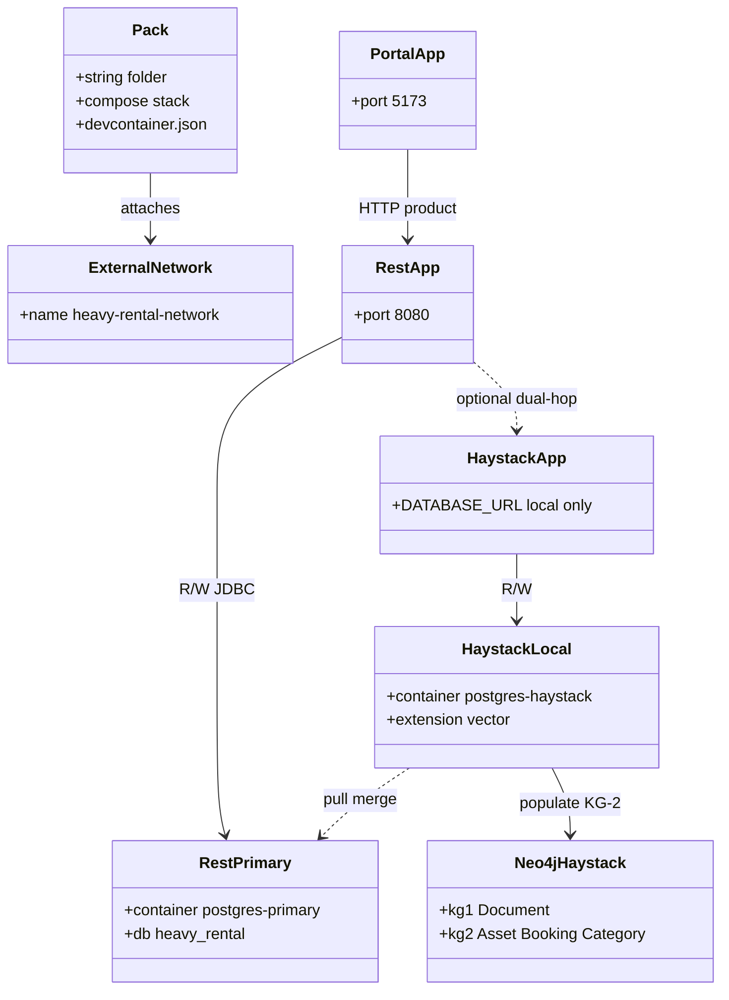

# Platform devcontainers (as-built)

## Requirements

- Provide three independently startable local-development packs (portal, REST, Haystack) that compose on one operator-created Docker network.
- Keep a single OLTP writer (Spring + `postgres-primary`) and a Haystack sandbox that pulls fleet data.
- Keep the browser on one public API (Spring); Haystack stays an internal capability plane.
- Give humans and agents a durable what / how / why contract (OpenSpec, OpenSPDD, ADR).

## Entities

## Approach

1. **Composition**: independent Compose projects, external network only (ADR-0001).
2. **Data**: pull merge + poll, not CDC or bidirectional sync (ADR-0002–0004, 0009).
3. **API**: portal → Spring; optional Spring → Haystack (ADR-0006).
4. **Docs**: spec-driven-with-adr + REASONS canvases (ADR-0010).

## Structure

### Layered architecture

1. Presentation: `heavy-rental-web-portal`
2. API / orchestration: `heavy-rental-rest-api`
3. Recommend / AI plane: `haystack-fast-api` + Neo4j + pgvector platform
4. OLTP store: `postgres-primary` (+ optional replica)
5. Mirror / graph stores: `postgres-haystack`, `neo4j-haystack`

### Dependencies

1. All packs depend on operator-created `heavy-rental-network`
2. Haystack merge-sync depends on `postgres-primary` for successful pull (skip if absent)
3. Portal product UX depends on REST HTTP
4. `neo4j-populate` depends on `postgres-haystack` and `neo4j` (soft-skip if down)

## Operations

### Keep pack layout

1. Responsibility: three folders, no root all-in-one Compose
2. Web Portal and Haystack: `.devcontainer` already at pack root
3. REST: nested packs; operator promotes one `.devcontainer` up one level (ADR-0005)

### Honor DNS and ports

| Host port | Service |
|-----------|---------|
| 5173 | Portal Vite |
| 8080 | Spring |
| 5432 | Primary |
| 5433 | Replica (optional) |
| 5434 | Haystack Postgres |
| 7474 / 7687 | Neo4j Browser / Bolt |
| 8089 | neo4j-populate admin |

### Update docs with the change

1. OpenSpec delta for the affected capability
2. ADR only if a durable decision changed
3. Sync this canvas (or the pack canvas)
4. Spec Kit verification/contracts if behavior is operator-visible

## Norms

1. Container/service names in specs MUST match Compose (`postgres-primary`, not ad-hoc aliases for SoT).
2. Dev credentials stay in pack READMEs and MUST be labeled local-dev-only.
3. Spec scenarios use `### Requirement` / `#### Scenario` with GIVEN/WHEN/THEN.
4. OpenSpec change order: proposal → specs → design → adr → tasks.
5. Logging for jobs: cycle outcome + METRICS (`duration_ms`, `expected_max_lag_seconds`).

## Safeguards

1. Do not add a repository-root Compose that starts all three packs.
2. Do not create `heavy-rental-network` from a pack Compose file (`external: true` only).
3. Do not write `postgres-primary` from Haystack jobs or the Haystack app default datasource.
4. Do not point the portal at Haystack or databases for product CRUD.
5. Do not install pgvector on REST primary.
6. Do not run global Neo4j deletes; never drop KG-1 (`:Document`) from populate.
7. Do not treat CDC / logical replication as the default fleet mirror.
8. Do not edit accepted files under `adr/`; supersede with a new ADR.
9. Do not expand the **default** D0 allowlist without a new schema-contract version and OpenSpec change.
10. Do not use committed default allowlist `all` unless a superseding ADR and SoT say so (debug override via env is allowed).
