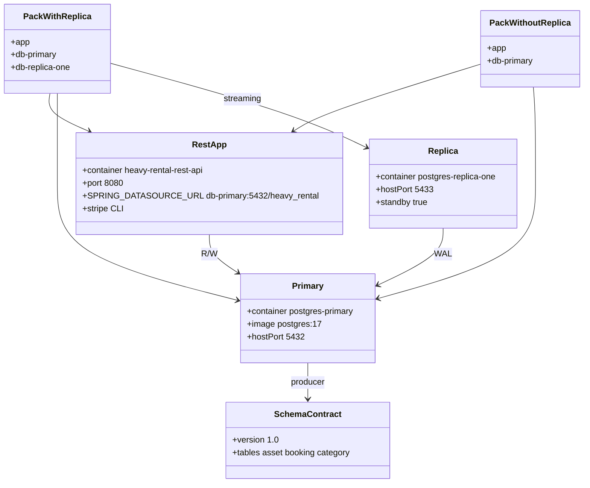

# REST API devcontainer packs (as-built)

## Requirements

- Give Spring Boot developers a Java 21 Dev Container with a writable Postgres primary (`heavy_rental`) on the shared network so Haystack can pull fleet tables.
- Offer an optional streaming replica for HA/read experiments without changing the app’s default datasource.
- Publish the D0 producer schema contract; do not run Haystack jobs in this pack.
- Install Stripe CLI in the app image so developers can forward webhooks to `/api/payments/webhook` without a host install.

## Entities

## Approach

1. **Two named nested packs**; operator promotes `.devcontainer` one level (ADR-0005).
2. **App always writes primary**; replica is infrastructure, not automatic read routing.
3. **Plain Postgres 17** on primary — no pgvector (ADR-0007).
4. **Pull source only** for Haystack (ADR-0002).

## Structure

### Inheritance / profiles

1. Shared baseline: app, primary, network, Java extensions, `vscode` user
2. With-replica extends baseline with `db-replica-one`, replicator role, WAL, IDE replica profile
3. Without-replica MUST NOT require a running replica

### Layered architecture

1. Dev workspace (Java 21 + Maven)
2. OLTP primary
3. Optional streaming standby
4. Producer schema contract (docs)

### Dependencies

1. App `depends_on` primary healthy
2. Replica bootstrap `depends_on` primary (with-replica only)
3. Haystack sync (peer) reads `postgres-primary` — not owned here

## Operations

### Promote

1. `cd Heavy-Rental-REST-API`
2. If `./.devcontainer` exists, remove or rename it
3. `mv "<pack>/.devcontainer" ./.devcontainer`
4. Open folder in VS Code Dev Containers

### Primary

1. Database/user/password (dev): `heavy_rental` / `postgres` / `postgres`
2. Host 5432; `pg_is_in_recovery()` is false

### Replica (with-replica pack)

1. `pg_basebackup` from primary, `standby.signal`, slot `replica_slot`
2. Host 5433; `pg_is_in_recovery()` is true
3. Replication role `replicator` / `replicatorpass` (local only)

### Stripe CLI

1. Dockerfile installs official `stripe` via Stripe Debian repo; `stripe --version` at build
2. COPY `scripts/start-stripe-listen.sh` to `/usr/local/bin/start-stripe-listen.sh`
3. `postStartCommand` runs that helper (not Spring Boot Dashboard Run)
4. Default forward: `http://localhost:8080/api/payments/webhook`
5. Start listen only if `STRIPE_API_KEY` or Stripe login config exists; otherwise print `stripe login` instructions and exit 0

## Norms

1. JDBC URL MUST remain `jdbc:postgresql://db-primary:5432/heavy_rental` in both packs.
2. Container name `postgres-primary` is the cross-pack DNS contract (Haystack does not use `db-primary`).
3. Producer contract path: `specs/001-rest-api-devcontainer/contracts/schema-contract.md`.
4. Spec Kit / OpenSpec identifiers MUST match Compose service, container, and port names.

## Safeguards

1. Do not implement merge-sync, neo4j-populate, or pgvector in this pack.
2. Do not point Spring default datasource at the replica.
3. Do not require extension `vector` on primary.
4. Do not ship a single already-promoted `.devcontainer` as the only pack (keep both nested packs in git).
5. Do not change D0 producer table names without a contract version bump and Haystack consumer alignment.
6. Do not use production credentials in Compose.
7. Do not add a Stripe Compose sidecar or bake `STRIPE_API_KEY` into Compose.
8. Do not assume Spring Boot Dashboard Run starts `stripe listen`.
