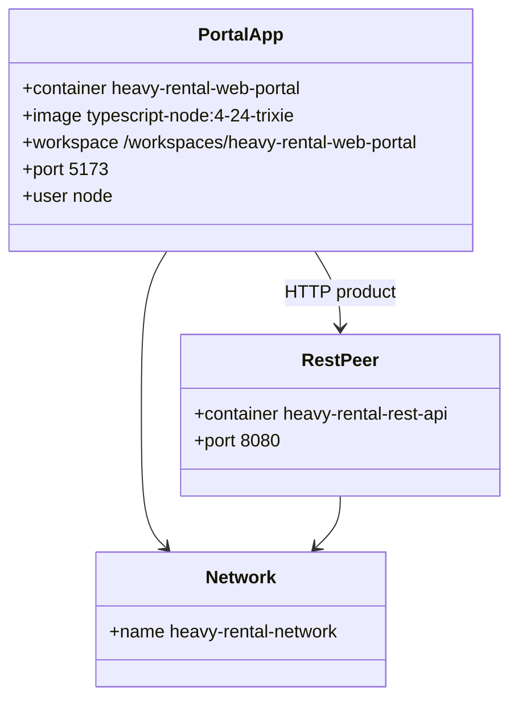

# Web Portal devcontainer (as-built)

## Requirements

- Give React / TypeScript developers a Node Dev Container with a forwarded Vite port and the shared Docker network so the UI can call the REST API.
- Do not run databases or Haystack in this pack.
- Keep product HTTP on Spring only (Haystack, if used, is dual-hop behind Spring).

## Entities

## Approach

1. **Single Compose service** at `Heavy-Rental-Web-Portal/.devcontainer/` (no promote step).
2. **No local DB**; peer REST pack supplies OLTP (ADR-0006, ADR-0002).
3. **API base URL is application config**, not a Compose secret in this pack.

## Structure

### Layered architecture

1. Host browser → forwarded 5173
2. Portal container (React / Vite workspace)
3. Peer REST (optional at container start)

### Dependencies

1. Network must exist
2. REST must be healthy for real data
3. Haystack is not a pack dependency

## Operations

### Open

1. Create `heavy-rental-network` if needed
2. Open `Heavy-Rental-Web-Portal` in VS Code Dev Containers (`.devcontainer` already at pack root)
3. `postCreateCommand` chowns workspace for `node`

### Peer usage

1. From another container: `http://heavy-rental-rest-api:8080`
2. From host browser: `http://localhost:8080` (CORS/proxy as app config)

## Norms

1. Remote user is `node` (not `vscode`).
2. Typical forward port **5173** (not 3000).
3. Extensions: React/ESLint/Prettier/Jest and related UI tooling.
4. Specs live under `Heavy-Rental-Web-Portal/openspec/` and `specs/001-web-portal-devcontainer/`.

## Safeguards

1. Do not add Postgres, Neo4j, or merge-sync to this pack.
2. Do not document Haystack as a browser-facing backend.
3. Do not store REST/Haystack DB passwords in this pack’s Compose.
4. Do not require Haystack to be up for the portal container to start.
5. Do not introduce a promote-pack step (unlike REST).
